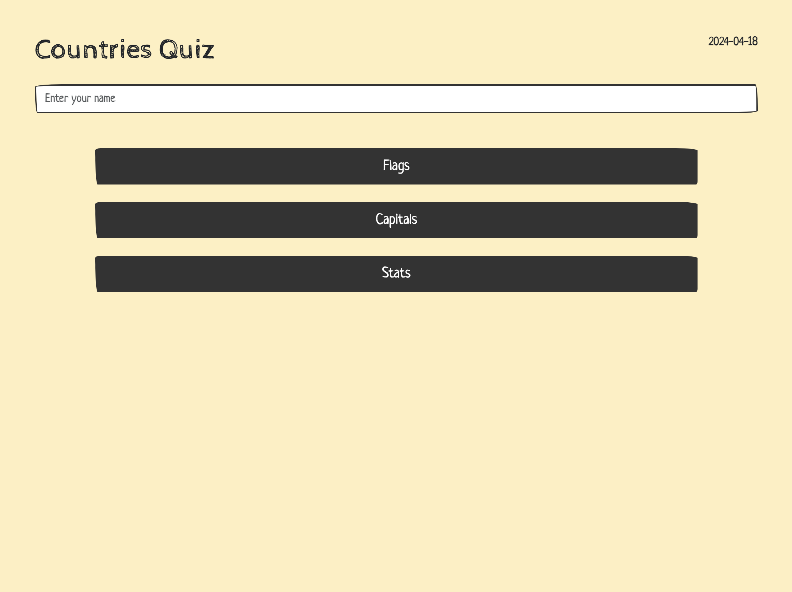
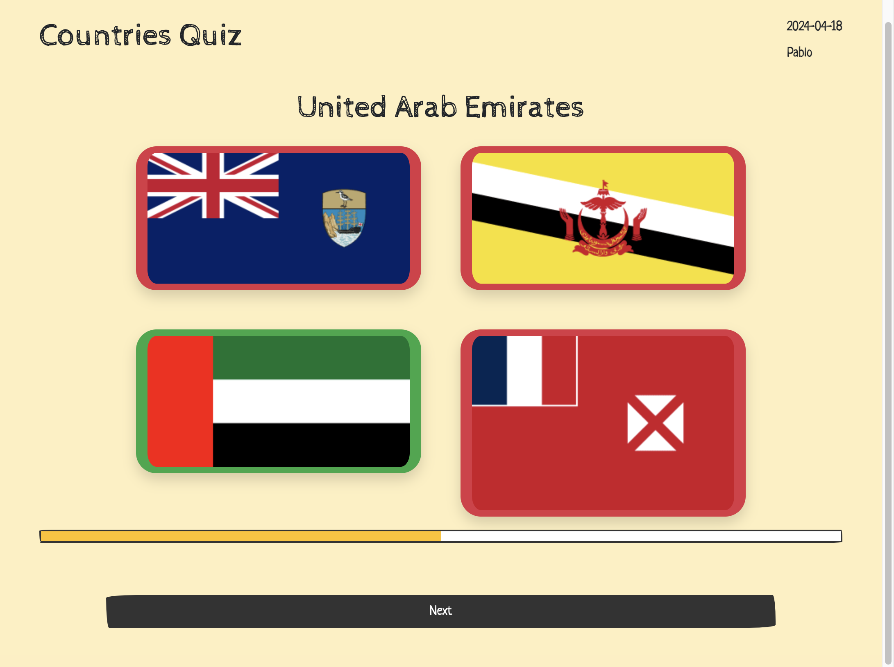
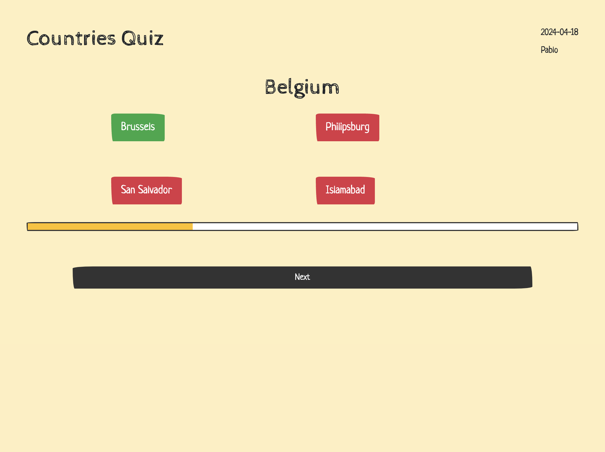
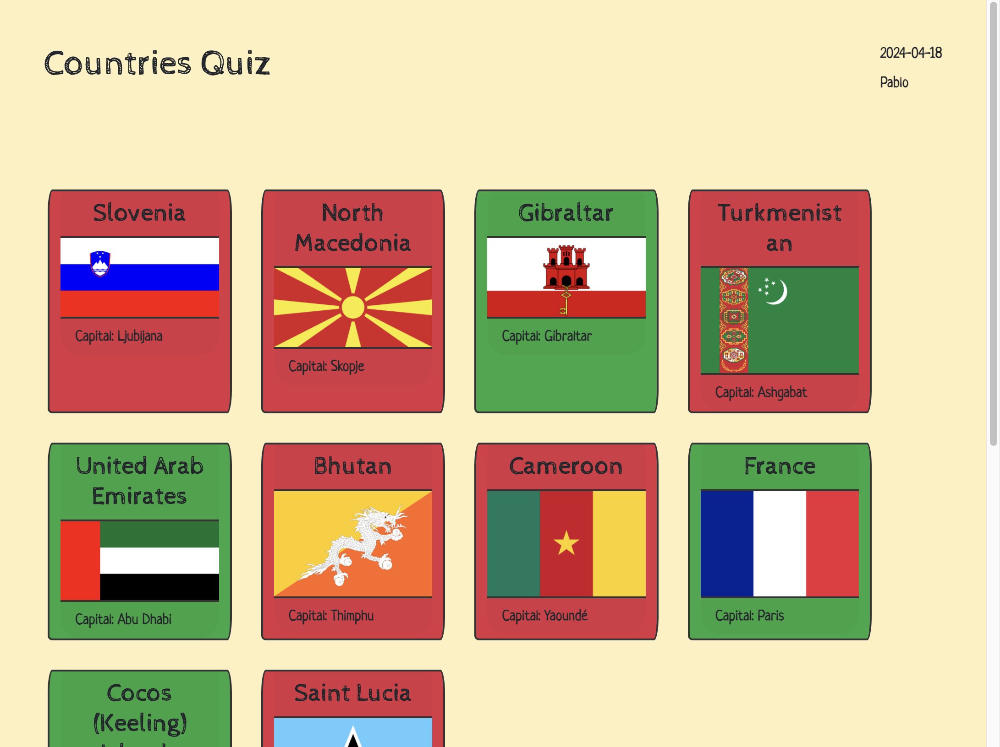
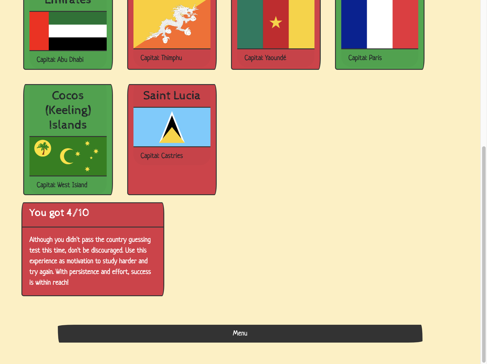
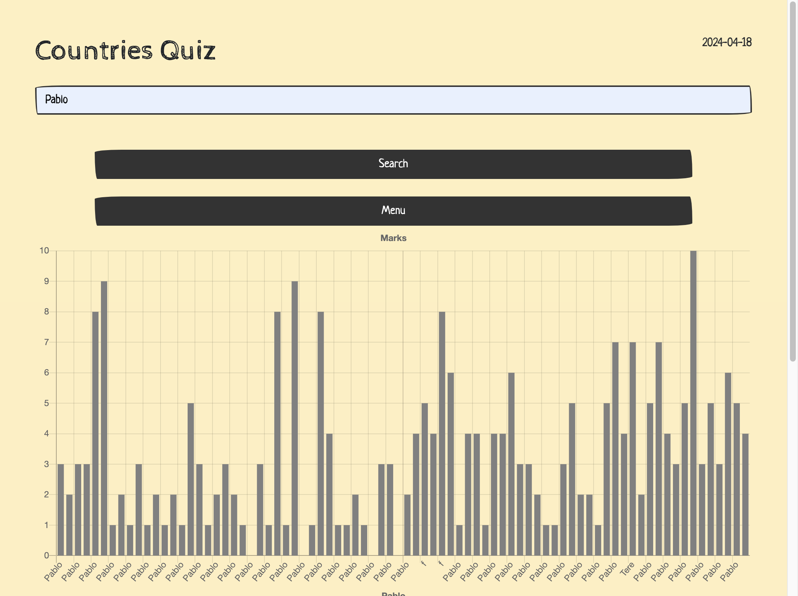
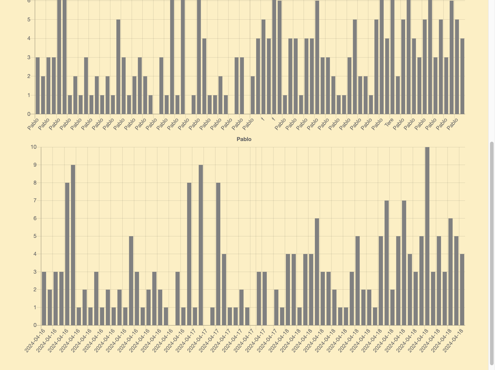

# Quiz sobre Países

Este es un proyecto de quiz sobre países, desarrollado en JavaScript y utilizando la librería Axios para acceder a una API de información sobre países. El juego presenta al usuario una serie de preguntas relacionadas con banderas y capitales de paises, y permite al usuario ingresar su nombre para llevar un registro de los puntajes.

## Instrucciones de Uso

1. Descarga o clona este repositorio en tu máquina local.
2. Abre el archivo `index.html` en tu navegador web preferido.
3. Ingresa tu nombre en el campo provisto y selecciona el tipo de juego que deseas iniciar (banderas o capitales).
4. Responde las preguntas haciendo clic en la opción que consideres correcta.
5. Después de responder todas las preguntas, se mostrará tu puntaje y podrás ver tus resultados.

## Características Principales
  
- El juego presenta preguntas aleatorias relacionadas con países y capitales.
  
- Permite al usuario seleccionar entre jugar adivinando las banderas de los países o las capitales.
  
- Muestra el puntaje del usuario y las preguntas acertadas y falladas al finalizar el juego y ofrece mensajes personalizados según el desempeño.
  
  
- Permite al usuario ver las puntuaciones de el resto de usuarios y buscar su historial de puntajes introduciendo su nombre.
  
  

## Tecnologías Utilizadas

- JavaScript
- Bootstrap 4
- Bootswatch
- Axios
- Chart.js

## API Utilizada

Se utiliza la API de Restcountries (https://restcountries.com/) para obtener información sobre países y capitales.

## Autor

Este proyecto fue desarrollado por Pablo González Sánchez.
